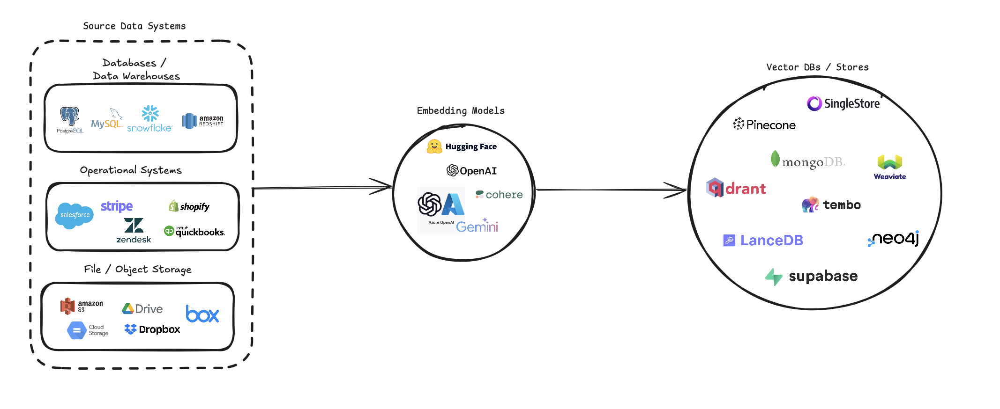

<div align="center">
        <a href="https://contextdata.ai"></a>
</div>

<br/>

<div align="center">

  <a href="https://opensource.org/licenses/MIT"></a>
  <a href="https://pypi.org/project/vector-etl/"></a>
  [](https://pepy.tech/project/vector-etl)

</div>

<h2 align="center">
  <p>VectorETL: Lightweight ETL Framework for Vector Databases</p>
</h2>

VectorETL by [Context Data](https://contextdata.ai) is a modular framework designed to help **Data & AI engineers process data for their AI applications in just a few minutes!**

VectorETL streamlines the process of converting diverse data sources into vector embeddings and storing them in various vector databases. It supports multiple data sources (databases, cloud storage, and local files), various embedding models (including OpenAI, Cohere, and Google Gemini), and several vector database targets (like Pinecone, Qdrant, and Weaviate).

This pipeline aims to simplify the creation and management of vector search systems, enabling developers and data scientists to easily build and scale applications that require semantic search, recommendation systems, or other vector-based operations.

### Features
- Modular architecture with support for multiple data sources, embedding models, and vector databases
- Batch processing for efficient handling of large datasets
- Configurable chunking and overlapping for text data
- Easy integration of new data sources, embedding models, and vector databases


### [Documentation](https://vectoretl.contextdata.dev/index.html)




## Table of Content
1. [Installation](#1-installation)
2. [Usage](#2-usage)
3. [Project Overview](#3-project-overview)
4. [Configuration](#4-configuration)
   - Source Configuration
   - Using [Unstructured](https://unstructured.io/api-key-hosted) to process source files
   - Embedding Configuration
   - Target Configuration
5. [Contributing](#5-contributing)
6. [Examples](https://github.com/ContextData/VectorETL/tree/main/examples)
7. [Documentation](https://vectoretl.contextdata.dev/index.html)


## 1. Installation
`pip install --upgrade vector-etl`

or

`pip install git+https://github.com/ContextData/VectorETL.git`


## 2. Usage

This section provides instructions on how to use the ETL framework for Vector Databases. We'll cover running, validating configurations, and provide some common usage examples.

### Option 1: Import VectorETL into your python application

```python
from vector_etl import create_flow

source = {
    "source_data_type": "database",
    "db_type": "postgres",
    "host": "localhost",
    "port": "5432",
    "database_name": "test",
    "username": "user",
    "password": "password",
    "query": "select * from test",
    "batch_size": 1000,
    "chunk_size": 1000,
    "chunk_overlap": 0,
}

embedding = {
    "embedding_model": "OpenAI",
    "api_key": ${OPENAI_API_KEY},
    "model_name": "text-embedding-ada-002"
}

target = {
    "target_database": "Pinecone",
    "pinecone_api_key": ${PINECONE_API_KEY},
    "index_name": "my-pinecone-index",
    "dimension": 1536
}

embed_columns = ["customer_name", "customer_description", "purchase_history"]

flow = create_flow()
flow.set_source(source)
flow.set_embedding(embedding)
flow.set_target(target)
flow.set_embed_columns(embed_columns)

# Execute the flow
flow.execute()
```

### Option 2: Import VectorETL into your python application (using a yaml configuration file)

Assuming you have a configuration file similar to the file below.

```yaml
source:
  source_data_type: "database"
  db_type: "postgres"
  host: "localhost"
  database_name: "customer_data"
  username: "user"
  password: "password"
  port: 5432
  query: "SELECT * FROM customers WHERE updated_at > :last_updated_at"
  batch_size: 1000
  chunk_size: 1000
  chunk_overlap: 0

embedding:
  embedding_model: "OpenAI"
  api_key: ${OPENAI_API_KEY}
  model_name: "text-embedding-ada-002"

target:
  target_database: "Pinecone"
  pinecone_api_key: ${PINECONE_API_KEY}
  index_name: "customer-embeddings"
  dimension: 1536
  metric: "cosine"

embed_columns:
  - "customer_name"
  - "customer_description"
  - "purchase_history"
```
You can then import the configuration into your python project and automatically run it from there
```python
from vector_etl import create_flow

flow = create_flow()
flow.load_yaml('/path/to/your/config.yaml')
flow.execute()
```

### Option 3: Running from the command line using a configuration file

Using the same yaml configuration file from Option 2 above, you can run the process directly from your command line without having to import it into a python application.

To run the ETL framework, use the following command:

```bash
vector-etl -c /path/to/your/config.yaml
```

### Common Usage Examples

Here are some examples of how to use the ETL framework for different scenarios:

#### 1. Processing Data from a PostgreSQL Database to Pinecone

```bash
vector-etl -c config/postgres_to_pinecone.yaml
```

Where `postgres_to_pinecone.yaml` might look like:

```yaml
source:
  source_data_type: "database"
  db_type: "postgres"
  host: "localhost"
  database_name: "customer_data"
  username: "user"
  password: "password"
  port: 5432
  query: "SELECT * FROM customers WHERE updated_at > :last_updated_at"
  batch_size: 1000
  chunk_size: 1000
  chunk_overlap: 0

embedding:
  embedding_model: "OpenAI"
  api_key: ${OPENAI_API_KEY}
  model_name: "text-embedding-ada-002"

target:
  target_database: "Pinecone"
  pinecone_api_key: ${PINECONE_API_KEY}
  index_name: "customer-embeddings"
  dimension: 1536
  metric: "cosine"

embed_columns:
  - "customer_name"
  - "customer_description"
  - "purchase_history"
```

#### 2. Processing CSV Files from S3 to Qdrant

```bash
vector-etl -c config/s3_to_qdrant.yaml
```

Where `s3_to_qdrant.yaml` might look like:

```yaml
source:
  source_data_type: "Amazon S3"
  bucket_name: "my-data-bucket"
  prefix: "customer_data/"
  file_type: "csv"
  aws_access_key_id: ${AWS_ACCESS_KEY_ID}
  aws_secret_access_key: ${AWS_SECRET_ACCESS_KEY}
  chunk_size: 1000
  chunk_overlap: 200

embedding:
  embedding_model: "Cohere"
  api_key: ${COHERE_API_KEY}
  model_name: "embed-english-v2.0"

target:
  target_database: "Qdrant"
  qdrant_url: "https://your-qdrant-cluster-url.qdrant.io"
  qdrant_api_key: ${QDRANT_API_KEY}
  collection_name: "customer_embeddings"

embed_columns: []
```

## 3. Project Overview

The VectorETL (Extract, Transform, Load) framework is a powerful and flexible tool designed to streamline the process of extracting data from various sources, transforming it into vector embeddings, and loading these embeddings into a range of vector databases.

It's built with modularity, scalability, and ease of use in mind, making it an ideal solution for organizations looking to leverage the power of vector search in their data infrastructure.

### Key Aspects:

1. **Versatile Data Extraction**:
   The framework supports a wide array of data sources, including traditional databases, cloud storage solutions (like Amazon S3 and Google Cloud Storage), and popular SaaS platforms (such as Stripe and Zendesk). This versatility allows you to consolidate data from multiple sources into a unified vector database.

2. **Advanced Text Processing**:
   For textual data, the framework implements sophisticated chunking and overlapping techniques. This ensures that the semantic context of the text is preserved when creating vector embeddings, leading to more accurate search results.

3. **State-of-the-Art Embedding Models**:
   The system integrates with leading embedding models, including OpenAI, Cohere, Google Gemini, and Azure OpenAI. This allows you to choose the embedding model that best fits your specific use case and quality requirements.

4. **Multiple Vector Database Support**:
   Whether you're using Pinecone, Qdrant, Weaviate, SingleStore, Supabase, or LanceDB, this framework has you covered. It's designed to seamlessly interface with these popular vector databases, allowing you to choose the one that best suits your needs.

5. **Configurable and Extensible**:
   The entire framework is highly configurable through YAML or JSON configuration files. Moreover, its modular architecture makes it easy to extend with new data sources, embedding models, or vector databases as your needs evolve.

This ETL framework is ideal for organizations looking to implement or upgrade their vector search capabilities.

By automating the process of extracting data, creating vector embeddings, and storing them in a vector database, this framework significantly reduces the time and complexity involved in setting up a vector search system. It allows data scientists and engineers to focus on deriving insights and building applications, rather than worrying about the intricacies of data processing and vector storage.


## 4. Configuration

The ETL framework uses a configuration file to specify the details of the source, embedding model, target database, and other parameters. You can use either YAML or JSON format for the configuration file.

### Configuration File Structure

The configuration file is divided into three main sections:

1. `source`: Specifies the data source details
2. `embedding`: Defines the embedding model to be used
3. `target`: Outlines the target vector database
4. `embed_columns`: Defines the columns that need to be embedded (mainly for structured data sources)

### Example Configurations

#### Importing VectorETL into your python application

```python
from vector_etl import create_flow

source = {
    "source_data_type": "database",
    "db_type": "postgres",
    "host": "localhost",
    "port": "5432",
    "database_name": "test",
    "username": "user",
    "password": "password",
    "query": "select * from test",
    "batch_size": 1000,
    "chunk_size": 1000,
    "chunk_overlap": 0,
}

embedding = {
    "embedding_model": "OpenAI",
    "api_key": ${OPENAI_API_KEY},
    "model_name": "text-embedding-ada-002"
}

target = {
    "target_database": "Pinecone",
    "pinecone_api_key": ${PINECONE_API_KEY},
    "index_name": "my-pinecone-index",
    "dimension": 1536
}

embed_columns = ["customer_name", "customer_description", "purchase_history"]
```

#### Standalone YAML File Configuration (e.g. config.yaml)

```yaml
source:
  source_data_type: "database"
  db_type: "postgres"
  host: "localhost"
  database_name: "mydb"
  username: "user"
  password: "password"
  port: 5432
  query: "SELECT * FROM mytable WHERE updated_at > :last_updated_at"
  batch_size: 1000
  chunk_size: 1000
  chunk_overlap: 0

embedding:
  embedding_model: "OpenAI"
  api_key: "your-openai-api-key"
  model_name: "text-embedding-ada-002"

target:
  target_database: "Pinecone"
  pinecone_api_key: "your-pinecone-api-key"
  index_name: "my-index"
  dimension: 1536
  metric: "cosine"
  cloud: "aws"
  region: "us-west-2"

embed_columns:
  - "column1"
  - "column2"
  - "column3"
```

#### Standalone JSON File Configuration (e.g. config.json)

```json
{
  "source": {
    "source_data_type": "database",
    "db_type": "postgres",
    "host": "localhost",
    "database_name": "mydb",
    "username": "user",
    "password": "password",
    "port": 5432,
    "query": "SELECT * FROM mytable WHERE updated_at > :last_updated_at",
    "batch_size": 1000,
    "chunk_size": 1000,
    "chunk_overlap": 0
  },

  "embedding": {
    "embedding_model": "OpenAI",
    "api_key": "your-openai-api-key",
    "model_name": "text-embedding-ada-002"
  },

  "target": {
    "target_database": "Pinecone",
    "pinecone_api_key": "your-pinecone-api-key",
    "index_name": "my-index",
    "dimension": 1536,
    "metric": "cosine",
    "cloud": "aws",
    "region": "us-west-2"
  },

  "embed_columns": ["column1", "column2", "column3"]
}
```

### Configuration Sections Explained

#### Source Configuration

The `source` section varies based on the `source_data_type`. Here are examples for different source types:

##### Database Source
```json
{
  "source_data_type": "database",
  "db_type": "postgres",  # or "mysql", "snowflake", "salesforce"
  "host": "localhost",
  "database_name": "mydb",
  "username": "user",
  "password": "password",
  "port": 5432,
  "query": "SELECT * FROM mytable WHERE updated_at > :last_updated_at",
  "batch_size": 1000,
  "chunk_size": 1000,
  "chunk_overlap": 0
}
```

```yaml
source:
  source_data_type: "database"
  db_type: "postgres"  # or "mysql", "snowflake", "salesforce"
  host: "localhost"
  database_name: "mydb"
  username: "user"
  password: "password"
  port: 5432
  query: "SELECT * FROM mytable WHERE updated_at > :last_updated_at"
  batch_size: 1000
  chunk_size: 1000
  chunk_overlap: 0
```

##### S3 Source
```json
{
  "source_data_type": "Amazon S3",
  "bucket_name": "my-bucket",
  "key": "path/to/files/",
  "file_type": ".csv",
  "aws_access_key_id": "your-access-key",
  "aws_secret_access_key": "your-secret-key"
}
```

```yaml
source:
  source_data_type: "Amazon S3"
  bucket_name: "my-bucket"
  key: "path/to/files/"
  file_type: ".csv"
  aws_access_key_id: "your-access-key"
  aws_secret_access_key: "your-secret-key"
```

##### Google Cloud Storage (GCS) Source
```json
{
  "source_data_type": "Google Cloud Storage",
  "credentials_path": "/path/to/your/credentials.json",
  "bucket_name": "myBucket",
  "prefix": "prefix/",
  "file_type": "csv",
  "chunk_size": 1000,
  "chunk_overlap": 0
}
```

```yaml
source:
  source_data_type: "Google Cloud Storage"
  credentials_path: "/path/to/your/credentials.json"
  bucket_name: "myBucket"
  prefix: "prefix/"
  file_type: "csv"
  chunk_size: 1000
  chunk_overlap: 0
```

#### Using Unstructured to process source files

Starting from version 0.1.6.3, users can now utilize the [Unstructured's Serverless API](https://unstructured.io/api-key-hosted) to efficiently extract data from a multitude of file based sources.

**NOTE:** This is limited to the Unstructured Severless API and should not be used for the Unstructured's open source framework

**This is limited to [PDF, DOCX, DOC, TXT] files**

In order to use Unstructured, you will need three additional parameters

1. `use_unstructured`: (True/False) indicator telling the framework to use the Unstructured API
2. `unstructured_api_key`: Enter your Unstructured API Key
3. `unstructured_url`: Enter your API Url from your Unstructured dashboard

```yaml
# Example using Local file
source:
  source_data_type: "Local File"
  file_path: "/path/to/file.docx"
  file_type: "docx"
  use_unstructured: True
  unstructured_api_key: 'my-unstructured-key'
  unstructured_url: 'https://my-domain.api.unstructuredapp.io'

# Example using Amazon S3
source:
  source_data_type: "Amazon S3"
  bucket_name: "myBucket"
  prefix: "Dir/Subdir/"
  file_type: "pdf"
  aws_access_key_id: "your-access-key"
  aws_secret_access_key: "your-secret-access-key"
  use_unstructured: True
  unstructured_api_key: 'my-unstructured-key'
  unstructured_url: 'https://my-domain.api.unstructuredapp.io'
```  

#### Embedding Configuration

The `embedding` section specifies which embedding model to use:

```yaml
embedding:
  embedding_model: "OpenAI"  # or "Cohere", "Google Gemini", "Azure OpenAI", "Hugging Face"
  api_key: "your-api-key"
  model_name: "text-embedding-ada-002"  # model name varies by provider
```

#### Target Configuration

The `target` section varies based on the chosen vector database. Here's an example for Pinecone:

```yaml
target:
  target_database: "Pinecone"
  pinecone_api_key: "your-pinecone-api-key"
  index_name: "my-index"
  dimension: 1536
  metric: "cosine"
  cloud: "aws"
  region: "us-west-2"
```

#### Embed Columns

The `embed_columns` list specifies which columns from the source data should be used to generate the embeddings (only applies to database sources for now):

```yaml
embed_columns:
  - "column1"
  - "column2"
  - "column3"
```

The `embed_columns` list is only required for structured data sources (e.g. PostgreSQL, MySQL, Snowflake). For all other sources, use an empty list

```yaml
embed_columns: []
```

### Handling Sensitive Information

To protect sensitive information like API keys and passwords, consider using environment variables or a secure secrets management system. You can then reference these in your configuration file:

```yaml
embedding:
  api_key: ${OPENAI_API_KEY}
```

This allows you to keep your configuration files in version control without exposing sensitive data.

Remember to adjust your configuration based on your specific data sources, embedding models, and target databases. Refer to the documentation for each service to ensure you're providing all required parameters.

## 5. Contributing

We welcome contributions to the ETL Framework for Vector Databases! Whether you're fixing bugs, improving documentation, or proposing new features, your efforts are appreciated. Here's how you can contribute:

### Reporting Issues

If you encounter a bug or have a suggestion for improving the ETL framework:

1. Check the [GitHub Issues](https://github.com/ContextData/VectorETL/issues) to see if the issue or suggestion has already been reported.
2. If not, open a new issue. Provide a clear title and description, and as much relevant information as possible, including:
   - Steps to reproduce (for bugs)
   - Expected behavior
   - Actual behavior
   - Your operating system and Python version
   - Relevant parts of your configuration file (remember to remove sensitive information)

### Suggesting Enhancements

We're always looking for ways to make the ETL framework better. If you have ideas:

1. Open a new issue on GitHub.
2. Use a clear and descriptive title.
3. Provide a detailed description of the suggested enhancement.
4. Explain why this enhancement would be useful to most users.

### Pull Requests

We actively welcome your pull requests:

1. Fork the repo and create your branch from `main`.
2. If you've added code that should be tested, add tests.
3. If you've changed APIs, update the documentation.
4. Ensure the test suite passes.
5. Make sure your code follows the existing style conventions (see Coding Standards below).
6. Issue that pull request!

### Coding Standards

To maintain consistency throughout the project, please adhere to these coding standards:

1. Follow [PEP 8](https://www.python.org/dev/peps/pep-0008/) style guide for Python code.
2. Use meaningful variable names and add comments where necessary.
3. Write docstrings for all functions, classes, and modules.
4. Keep functions small and focused on a single task.
5. Use type hints to improve code readability and catch potential type-related errors.

### Documentation

Improving documentation is always appreciated:

- If you find a typo or an error in the documentation, feel free to submit a pull request with the correction.
- For substantial changes to documentation, please open an issue first to discuss the proposed changes.

### Adding New Features

If you're thinking about adding a new feature:

1. Open an issue to discuss the feature before starting development.
2. For new data sources:
   - Add a new file in the `source_mods` directory.
   - Implement the necessary methods as defined in the base class.
   - Update the `get_source_class` function in `source_mods/__init__.py`.
3. For new embedding models:
   - Add a new file in the `embedding_mods` directory.
   - Implement the necessary methods as defined in the base class.
   - Update the `get_embedding_model` function in `embedding_mods/__init__.py`.
4. For new vector databases:
   - Add a new file in the `target_mods` directory.
   - Implement the necessary methods as defined in the base class.
   - Update the `get_target_database` function in `target_mods/__init__.py`.

### Testing

- Write unit tests for new features or bug fixes.
- Ensure all tests pass before submitting a pull request.
- Aim for high test coverage, especially for critical parts of the codebase.

### Commit Messages

- Use clear and meaningful commit messages.
- Start the commit message with a short summary (up to 50 characters).
- If necessary, provide more detailed explanations in subsequent lines.

### Review Process

- All submissions, including submissions by project members, require review.
- We use GitHub pull requests for this purpose.
- Reviewers may request changes before a pull request can be merged.

### Community (Discord)

We encourage all users to join our [Discord server](https://discord.gg/8agCy6bM) to collaborate with the Context Data development team and other contributors in order to suggest upgrades, new integrations and issues.
